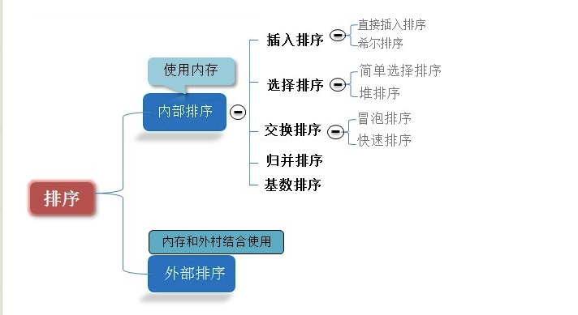

# 排序
排序有内部排序 外部排序之分，
* 内部排序  在内存中进行排序
* 外部排序  因排序量大而需要访问外存

### 八大排序
排序分为基于两两比较和非两两比较的   也分为稳定和不稳定的    当然也会分为快的和不快的

八大排序都是内部排序

快速排序：是目前基于比较的内部排序中被认为是最好的方法，当待排序的关键字是随机分布时，快速排序的平均时间最短；

##### 插入排序

**plus**
  希尔排序(shell sort)  不稳定

先对序列的若干子序列执行插入排序，使得序列相对有序，再对全序列插入排序

上面是在写好的插入函数中稍加修改 就可以得到希尔排序算法

下面是重用直接插入排序的insert函数

##### 选择排序
* 简单选择排序
在要排序的一组数中，选出最小（最大）的数与第一个位置的数交换，然后在找 与第二个数交换

* 改进-二元选择排序
就是在头尾都进行判断并修改，一次遍历定位两个数据（最大和最小）
zz

这里一定要注意，如果边界数上的数字最大或最小（即应该换到另一边的）时候一定要进行稍稍复杂的判断，（这里出现bug，解决bug，过程不是那么愉悦）

##### 堆排序
